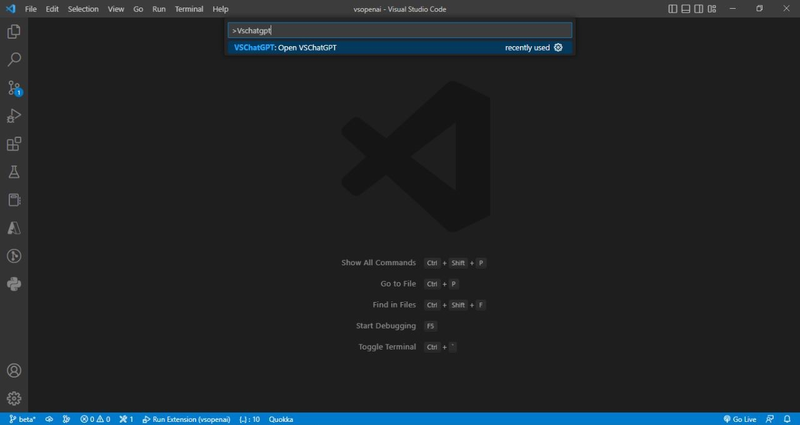

# VSChatGPT README

VSChatGPT is an extension for Visual Studio Code that integrates the OpenAI ChatGPT AI into VS Code editor.
Find my extension on [Microsoft Marketplace](https://marketplace.visualstudio.com/items?itemName=VatsalyaSinghi.vschatgpt)
## Usage

Run the command `VSChatGPT: Open VSChatGPT` to run OpenAI GPT-3

##  About ChatGPT
ChatGPT can be a powerful tool for coding, by providing more accurate and informative results for various coding tasks which can save time and effort for programmers It can be useful for coding in a number of ways:

- Code completion: ChatGPT can be used to generate code snippets, which can help programmers complete their code faster and with fewer errors.

- Code documentation: ChatGPT can be used to generate code documentation, such as comments and docstrings, which can help programmers and other team members understand the code better.

- Error messages: ChatGPT can be used to generate error messages that are more informative and easier for programmers to understand.

- Debugging: ChatGPT can be used to generate possible solutions for bugs and issues, which can speed up the debugging process.

- Language Model fine-tuning: Programmers can use pre-trained models like ChatGPT to fine-tune their model on the specific domain or task, which can help the model to understand the code and generate more accurate results.

## Requirements

To use VS ChatGPT you must have an [OpenAI account](https://beta.openai.com/) and have generated an [API Secret Key](https://beta.openai.com/account/api-keys).

## Release Notes

### 0.0.5
- Copy to Clipboard feature addition

### 0.0.4
- Incremental Updates
- Major Rollout

### 0.0.3
- Incremental Updates

### 0.0.2
- Bug Fixes

### 0.0.1
- Initial Updates

